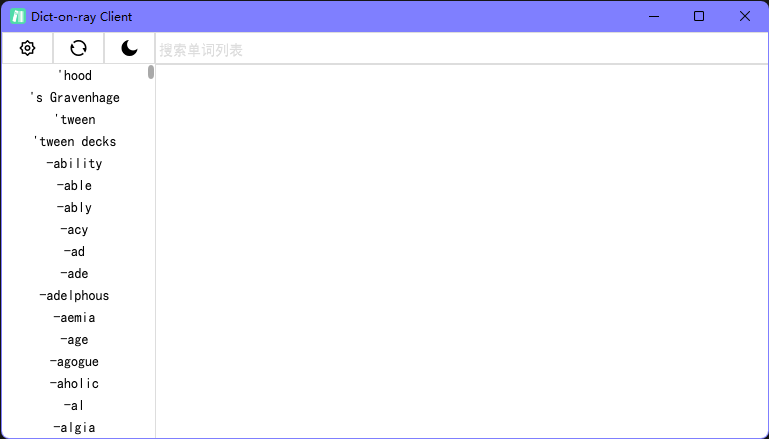
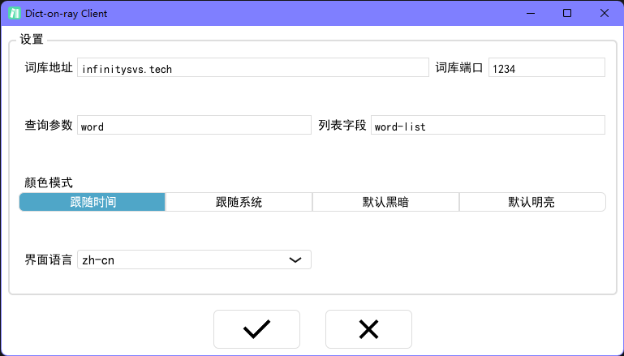

[TOC]
# Dict-on-ray
**简单英语词典（多语言支持版）**  
**(C)2022 無常。保留所有权利。**

## 综述
Dict-on-ray 是一个高效的在线词典系统，该系统提供了客户端、服务端与词典编译器应用，支持多种语言的词库。  
Dict-on-ray 客户端是一个轻量级的词典客户端应用，该应用使用 C++ 开发，UI 使用 JUCE 框架实现，同时使用 OpenGL 渲染界面。  
Dict-on-ray 服务端是该系统中的服务端应用，使用 libevent 库与 openssl 提供 https 服务，整体由 C 语言实现，支持在高并发场景下对 dicx 词典文件进行高效的查找。  
Dictc 编译器是使用 C++ 标准库与 C 标准库混合开发的高性能词典编译器，可以在 O(n) 的时间复杂度下将任意 UTF-8 编码的 csv 格式的词典源文件编译为 dicx 词典，支持自定义 csv 文件的列名。

-----

## 源码与下载
Github 仓库：[https://github.com/FangCunWuChang/Dict_on_ray.git](https://github.com/FangCunWuChang/Dict_on_ray.git)  
**Dict-on-ray 使用GPLv3许可协议。**

## 编译与安装
Dict-on-ray 使用 CMake 构建系统进行构建，项目中含有三个构建目标 `dictc`、`server` 和 `client`。分别为编译器、服务端和客户端。

### dictc
#### 首选平台
操作系统：Ubuntu 20.04 LTS  
架构：amd64  
编译器：GNU GCC 12

#### 备选平台
操作系统：Windows 11  
架构：amd64  
编译器：MSVC v143

#### 额外的依赖库
无

### server
#### 首选平台
操作系统：Ubuntu 20.04 LTS  
架构：amd64  
编译器：GNU GCC 12

#### 备选平台
操作系统：Windows 11  
架构：amd64  
编译器：MSVC v143

#### 额外的依赖库
libevent openssl

### client
#### 首选平台
操作系统：Windows 11  
架构：amd64  
编译器：MSVC v143

#### 额外的依赖库
opengl

-----

## Dictc 编译器
### 平台
#### 理论支持
系统：Windows/Linux/MacOS  
架构：amd64

#### 开发与测试
系统：Windows11/Ubuntu2004  
架构：amd64

#### 发行版
系统：Ubuntu2004  
架构：amd64

### 调用命令
```bash
dictc <options> --in <file> (--out <file>) (--word <title>) (--translation <title>) ...
```
- `--help` 显示帮助信息。
- `--version` 显示版本号。
- `--in` 选择输入的 csv 词典，该文件编码为 UTF-8。此选项是必需的，如缺少此选项，程序将退出。
- `--out` 选择输出的 dicx 词典文件，如果未指定输出文件，则输出文件名与输入文件名除扩展名外保持一致，输出文件扩展名为 dicx 。如输入文件无扩展名或文件名为".xxxx"的形式，则直接在文件名后追加 dicx 扩展名。
- `--word` 指定输入的 csv 文件中的单词列名，如果未指定，则默认为"word"。
- `--translation` 指定输入的 csv 文件中的翻译列名，如果未指定，则默认为"translation"。

### 语法错误提示
- Redefined of word tag  
  源文件中有多个列的列名与指定的单词列名相同

- Redefined of translation tag  
  源文件中有多个列的列名与指定的翻译列名相同

- Quotation marks are not paired  
  当前行中存在引号不匹配

- Invalid end of line  
  不正确的行尾，csv标准中行尾应为`"\r\n"`

- Too short  
  源文件首行（列名称行）的列数为0

- Undefine of word tag  
  源文件中有没有列的列名与指定的单词列名相同

- Undefine of translation tag  
  源文件中有没有列的列名与指定的翻译列名相同

- Number of columns does not match  
  当前行的列数与首行列数不匹配

- The number of words and translations are not equal  
  存在单词与翻译数量不一致的情况，此条错误信息的出现一般是由于源文件出错或编译器内部错误

- No words  
  源文件中只有首行

### dicx 文件格式
dicx 文件是一种分段的致密的文件格式，该文件结构可以与服务端高效查找相适应。dicx 文件每个段由 4 字节段名称、4 字节段长度和段数据组成，段名称由字母、数字、英文句号组成，段长度是段数据的字节数，以 uint32 的形式储存。  
1.0 版本的 dicx 文件由两个用于查找的索引段 `.idw`、`.idt` 和两个内容段 `.lst`、`.tsl` 构成。

#### `.idw` 段
该段内容为一串连续的 uint32 数值，每个数值代表 `.lst` 段中一个单词的起始位置相对于 `.lst` 段数据起始位置的偏移，数值以所对应的字符串大小顺序由小到大排列。（字符串大小由 `strcmp` 函数或相同算法得出）

#### `.idt` 段
该段内容为一串连续的 uint32 数值，每个数值代表 `.idw` 段相应位置的单词的翻译在 `.tsl` 段中的起始位置相对于 `.tsl` 段数据起始位置的偏移。

#### `.lst` 段
该段内容为字符串形式的单词列表，编码为 UTF-8，每个单词后以一个`'\n'`分隔（包括最后一个单词），该段末尾由一个`'\0'`结尾。该段内数据的储存顺序与源文件中的储存顺序一致，在编译过程中仅对索引的顺序进行调整。

#### `.tsl` 段
该段内容为字符串形式的翻译列表，编码为 UTF-8，每条翻译后以一个`'\0'`分隔（包括最后一个条翻译）。该段内数据的储存顺序与源文件中的储存顺序一致。

-----

## Dict-on-ray 服务端
### 平台
#### 理论支持
系统：Windows/Linux  
架构：amd64

#### 开发与测试
系统：Windows11/Ubuntu2004  
架构：amd64

#### 发行版
系统：Ubuntu2004  
架构：amd64

### 启动命令
**建议以 nohup 的方式启动服务端应用或使用 systemd 启动。**
```bash
dict-server <options> [args] ...
```
- `--help`,`-h` 显示帮助信息。
- `--version` 显示版本号。
- `--config` 指定配置文件，默认为 /etc/dict-on-ray.conf，如默认配置文件不存在，程序将以默认配置启动。
- `--port`,`-p` 设置监听端口，默认为 443。
- `--max_connection` 设置最大并发数量，超出数量的 https 连接将进入等待，默认为 1000。
- `--ssl_cer` 设置 ssl 证书，默认为 /root/.ssl/server-certificate-chain.pem。
- `--ssl_key` 设置 ssl 密钥，默认为 /root/.ssl/server-private-key.pem。
- `--query` 设置单词查询请求的字段，默认为"word"。
- `--list` 设置获取单词列表请求的地址，默认为"/word-list"。
- `--source` 设置加载的 dicx 词典文件，默认为 /root/dict/ENG_ZH.dicx。
- `--log` 设置日志保存位置，默认为 /var/log/dict-on-ray.log。

### systemd 启动
通过生成的 deb 包安装的服务端应用支持使用 systemd 启动服务，使用 systemd 启动的 Dict-on-ray 服务端默认使用 1234 端口。
```bash
sudo systemctl start dict.service
sudo systemctl stop dict.service
sudo systemctl restart dict.service
sudo systemctl status dict.service

sudo systemctl enable dict.service
sudo systemctl disable dict.service
```

### 配置文件示例
Dict-on-ray 服务端使用的配置参数优先级顺序为 启动命令>配置文件>默认参数，高优先级的配置将会覆盖低优先级的配置。
```ini
[net]
port = 443
max_connection = 1000

[ssl]
ssl_key = "/root/.ssl/server-private-key.pem"
ssl_cer = "/root/.ssl/server-certificate-chain.pem"

[request]
query = "word"
list = "/word-list"

[dictionary]
source = "/root/dict/ENG_ZH.dicx"

[log]
log = "/var/log/dict-on-ray.log"
```

### https API
#### 单词列表
访问 `https://hostname:port/list-query` 获取词库中的单词列表（list-query 应为实际的配置）。返回以`'\n'`分隔的单词列表（包括末尾单词），该列表内容与 dicx 文件中 `.lst` 段数据一致，编码为 UTF-8。

#### 查询
通过 GET 请求的方式向服务器获取某条单词的翻译。如通过 `https://hostname:port/?query=xxx`（query 应为实际的请求字段），获取单词的翻译，返回内容为一个 UTF-8 编码的 json 串，如
```json
{"peer":{"address":"61.190.213.238","port":10271},"status":true,"word":"abandon","result":"vt. 放弃, 抛弃, 遗弃, 使屈从, 沉溺, 放纵\nn. 放任, 无拘束, 狂热"}
```
- `"peer"` 发起请求的客户端的 ip 和端口。
- `"status"` 服务端是否在词库中找到了目标单词。
- `"word"` 服务端实际查找的目标单词。
- `"result"` 服务端的查找结果（含转义字符）。

#### http 状态码
- `200` 正常响应
- `400` 意料外的请求参数
- `404` 非法访问
- `503` 服务端发生内存错误

-----

## Dict-on-ray 客户端
### 平台
#### 理论支持
系统：Windows/Linux/Mac  
架构：amd64

#### 开发与测试
系统：Windows11  
架构：amd64

#### 发行版
系统：Ubuntu2004  
架构：amd64

### 主界面

1. 工具按钮
   - 显示设置页面
   - 重新同步单词列表
   - 切换明暗主题
2. 单词列表  
   选择一个单词查看翻译
3. 搜索单词  
   对单词列表进行筛选，通过 KMP 匹配保留含有搜索框中子串的单词，按回车键进行搜索。当搜索框为空时不进行筛选。
4. 结果显示  
   显示查询的单词与翻译或出错信息。

### 设置界面

1. 词库地址  
   服务端所在的服务器域名或 ip 地址。
2. 词库端口  
   服务端监听的端口，应与服务端 `port` 配置一致。
3. 查询参数  
   查询单词翻译的地址，应与服务端 `query` 配置一致。
4. 列表字段  
   获取单词列表的地址，应与服务端 `list` 配置一致。
5. 颜色模式  
   客户端启动时的默认配色方案。
   - 跟随时间：在 6 时与 18 时之间默认使用明亮配色，其他时间默认黑暗。同时在 6 时与 18 时界面会自动切换颜色。
   - 跟随系统：默认配色方案与系统设置中的颜色设置相同。同时当系统颜色设置改变时，客户端颜色也跟随改变。
   - 默认黑暗：默认使用黑暗配色，颜色不会自动改变。
   - 默认明亮：默认使用明亮配色，颜色不会自动改变。
6. 界面语言  
   选择客户端界面的语言。
   - zh-cn 中文简体 無常
   - en-us 英语（美国） 無常

-----

## 致谢
~~我真的会谢~~  
Dict-on-ray 从拿到课设题目-选题-立项开始，到完成整个项目，花了正好三周的时间。在这三周里，我也实现了三周前所说的“挑战自我”。  
选择“简单英语词典”这个题目的最初目的其实是想摆，毕竟这个题目已经把“简单”二字写在了标题上。然而也许在日常生活中我本人是个比较随性的人，但在写代码上会格外的较真。本着“任何一行开源代码都是属于全人类的”的原则，我不想在我的手里给人类文明“加屎”，于是很快我做课设的目的就变了。  
大一上学期的课设我做了选课系统，虽然获得了满分，但当时也留下了一些遗憾。比如没有使用 CMake 构建系统，没有用一个主流的网络通信协议，没有用一个主流的后端框架，也没有使用真正高效的数据储存结构，还没有应用任何一种成型的软件设计模式。因此，这次我把目标定为了“全面吊打上次课设”。  
在这半年里，对于我来说，在技术方面也发生了很多的变化。我离开之前三年所熟悉的 Qt 框架，转向了更为轻便与先进，同时更为适合我所在的音频客户端领域的 JUCE 框架。我也学习了 CMake 构建系统，实话实说挺难学，但也挺好用。在不断的代码磨合中，我也对 C++、编译器、操作系统和通信协议有了更为深入的认识。因此，课设成为了我验证这半年来技术水平的渠道，也成为了一些我所学习到，但没有机会去应用的技术的测试场。  
Dictc 是我第一次写编译器，做的也许还不是最好，但得益于对 C++ 的熟悉，Dictc 有了非常精彩的表现。在测试数据集 ECDICT 的 77 万条数据上，运行只消耗了不到源文件 2 倍的内存体积和大约 10s 的编译时间。  
Dict-on-ray 服务端上我试验了使用 libevent 实现 https 通信，并获得了成功。同时在这个过程中，我对 C 语言的内存管理有了更深入的理解，并且明确了 C 语言与 C++ 在语法内涵上的区别。最终我获得了这个性能怪物般的服务端程序。  
Dict-on-ray 客户端使用了目前我使用的主力框架 JUCE，同时我试验了使用 OpenGL 加速渲染 UI,并且我第一次制作了实时渲染的界面动画。在很久之前学到的 KMP 模式匹配在这里也得到了应用，并且效果是令人惊喜的。  
我想我在 C++ 的路上大约是在渐入佳境，从入门向着熟练发展，并且进入了良性循环。虽然我的日常生活是一团糟：每日泡面、一学期挂了四科（布置四科，大后天我高数肯定也寄了）、面临编下风险、一天 23 个小时待在床上（我在床上写代码）、一学期只上了两节课，但我想，C++ 是好的我就是好的。  
C++20 标准有协程，但人没有协程。我知道我很怪（也许反社会，也许有表演型人格倾向），但我宁愿专注于只有少数人理解但我热爱的东西，不愿人生分散于光怪陆离。哪怕这是一条孤独的路，可能孤独得令人窒息，但我想，C++ 是好的我就是好的。  
说了这么多，还没有真正写什么致谢，那么就以真正的致谢做为结尾。  
感谢我的好友雨宮華憐，参与了 Dict-on-ray 的测试以及高分屏显示优化，也是平时和我交流最多的人，虽然空间距离遥远，只能在网上聊天。  
感谢我的宿舍舍友，参与了 Dict-on-ray 的测试，也使我平日里不至于完全脱离社会交流。  
感谢同学们，没人忘了我。  
感谢群友们，不离不弃。  
也要感谢坚定的在 C++ 路上走下去的自己。  

無常，2022 年 7 月 9 日晚于合肥工业大学宣城校区学生宿舍 5 号楼
